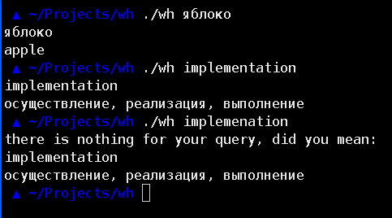

# Консольный клиент сайта [wooordhunt][wooordhunt.ru]

## Использование и демо

## Установка

Сначала установите `make`, `git`, `python3` и `pip3`, затем выполните:

	git clone https://github.com/iv4n-t3a/wh.git
	cd wh
	pip3 install -r requirements.txt
	sudo make install

Установка при помощи `make` работает только на unix-like системах,
т.к. при помощи утилиты `install` устанавливает исполняемый файл в каталог `/bin/`,
на других системах предлагается запускать файл wh из каталога проекта
